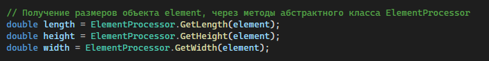
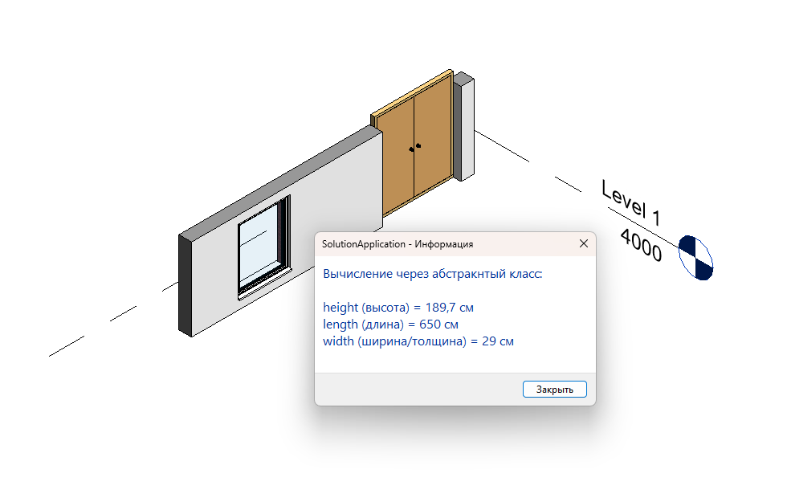

### Проект для реализации задания:

#### Задание:
По принципу SOLID создать абстрактный класс / интерфейс с методами GetWidth, GetLenght, GetWeight. 
Реализовать классы на основе абстрактного для получения данных от Стены, Окна/Двери в Revit. 
Можно добавить принимаемый параметр с ElementId сразу, чтобы протестировать можно было

#### Что сделал:

Создал абстрактный класс BuildingElement (в файле GetDimensionsElement.cs), в котором реализолвал методы GetLength, GetHeight, GetWidth, для объектов типа стена, окно и дверь. Объект выбирается нажатием мышки

---

### Также здесь сделал задание:

#### Задание:

Сделать метод для удобной установки комментария конкретному Element из кода

